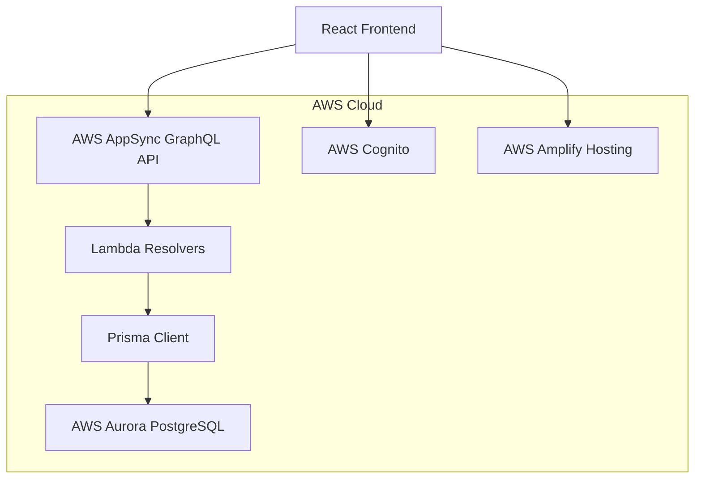

# Design Document

## Overview

The Simple CRM system will be built as a modern, cloud-native web application using React 18 with TypeScript for the frontend, AWS Aurora PostgreSQL for data persistence, GraphQL with AWS AppSync for API layer, Prisma as the ORM, Tailwind CSS with shadcn/ui for styling, and AWS Amplify for hosting and CI/CD.

The architecture follows a serverless approach leveraging AWS managed services for scalability, security, and cost-effectiveness. The application will use AWS Cognito for authentication and authorization, ensuring secure access to customer data.

## Architecture

### High-Level Architecture



### Frontend Architecture

- **React 18**: Modern React with concurrent features and hooks
- **TypeScript**: Type safety and better developer experience
- **Tailwind CSS + shadcn/ui**: Utility-first CSS with pre-built accessible components
- **React Router**: Client-side routing
- **Apollo Client**: GraphQL client with caching and state management
- **React Hook Form**: Form handling with validation

### Backend Architecture

- **AWS AppSync**: Managed GraphQL service with real-time subscriptions
- **AWS Lambda**: Serverless compute for custom business logic
- **Prisma**: Type-safe database client and schema management
- **AWS Aurora PostgreSQL**: Managed relational database with auto-scaling

## Components and Interfaces

### Frontend Components

#### Core Layout Components
- `AppLayout`: Main application shell with navigation
- `Sidebar`: Navigation menu with role-based visibility
- `Header`: Top navigation with user profile and search
- `LoadingSpinner`: Reusable loading indicator
- `ErrorBoundary`: Error handling wrapper

#### Feature Components
- `ContactList`: Display and filter contacts
- `ContactForm`: Create/edit contact information
- `ContactDetail`: Detailed contact view with activities
- `LeadList`: Display and manage leads
- `LeadForm`: Create/edit lead information
- `LeadDetail`: Detailed lead view with conversion options
- `ActivityTimeline`: Display chronological activities
- `ActivityForm`: Create new activities and tasks
- `Dashboard`: Overview with metrics and recent activities

#### UI Components (shadcn/ui based)
- `Button`: Various button styles and states
- `Input`: Form input fields with validation
- `Select`: Dropdown selection components
- `Dialog`: Modal dialogs for forms and confirmations
- `Table`: Data tables with sorting and pagination
- `Card`: Content containers
- `Badge`: Status indicators

### GraphQL Schema

#### Types
```graphql
type Contact {
  id: ID!
  firstName: String!
  lastName: String!
  email: String!
  phone: String
  company: String
  position: String
  createdAt: AWSDateTime!
  updatedAt: AWSDateTime!
  activities: [Activity!]!
  leads: [Lead!]!
}

type Lead {
  id: ID!
  title: String!
  description: String
  status: LeadStatus!
  value: Float
  contactId: ID!
  contact: Contact!
  createdAt: AWSDateTime!
  updatedAt: AWSDateTime!
  activities: [Activity!]!
}

type Activity {
  id: ID!
  type: ActivityType!
  title: String!
  description: String
  dueDate: AWSDateTime
  completed: Boolean!
  contactId: ID
  leadId: ID
  createdAt: AWSDateTime!
  updatedAt: AWSDateTime!
}

enum LeadStatus {
  NEW
  CONTACTED
  QUALIFIED
  PROPOSAL
  NEGOTIATION
  CONVERTED
  LOST
}

enum ActivityType {
  CALL
  EMAIL
  MEETING
  TASK
  NOTE
}
```

#### Queries and Mutations
```graphql
type Query {
  listContacts(filter: ContactFilterInput, limit: Int, nextToken: String): ContactConnection!
  getContact(id: ID!): Contact
  listLeads(filter: LeadFilterInput, limit: Int, nextToken: String): LeadConnection!
  getLead(id: ID!): Lead
  listActivities(filter: ActivityFilterInput, limit: Int, nextToken: String): ActivityConnection!
  searchContacts(searchTerm: String!): [Contact!]!
}

type Mutation {
  createContact(input: CreateContactInput!): Contact!
  updateContact(input: UpdateContactInput!): Contact!
  deleteContact(id: ID!): Contact!
  createLead(input: CreateLeadInput!): Lead!
  updateLead(input: UpdateLeadInput!): Lead!
  deleteLead(id: ID!): Lead!
  createActivity(input: CreateActivityInput!): Activity!
  updateActivity(input: UpdateActivityInput!): Activity!
  deleteActivity(id: ID!): Activity!
}
```

## Data Models

### Database Schema (Prisma)

```prisma
model Contact {
  id        String   @id @default(cuid())
  firstName String
  lastName  String
  email     String   @unique
  phone     String?
  company   String?
  position  String?
  createdAt DateTime @default(now())
  updatedAt DateTime @updatedAt
  userId    String   // AWS Cognito user ID
  
  activities Activity[]
  leads      Lead[]
  
  @@map("contacts")
}

model Lead {
  id          String     @id @default(cuid())
  title       String
  description String?
  status      LeadStatus @default(NEW)
  value       Float?
  contactId   String
  createdAt   DateTime   @default(now())
  updatedAt   DateTime   @updatedAt
  userId      String     // AWS Cognito user ID
  
  contact    Contact    @relation(fields: [contactId], references: [id], onDelete: Cascade)
  activities Activity[]
  
  @@map("leads")
}

model Activity {
  id          String       @id @default(cuid())
  type        ActivityType
  title       String
  description String?
  dueDate     DateTime?
  completed   Boolean      @default(false)
  contactId   String?
  leadId      String?
  createdAt   DateTime     @default(now())
  updatedAt   DateTime     @updatedAt
  userId      String       // AWS Cognito user ID
  
  contact Contact? @relation(fields: [contactId], references: [id], onDelete: Cascade)
  lead    Lead?    @relation(fields: [leadId], references: [id], onDelete: Cascade)
  
  @@map("activities")
}

enum LeadStatus {
  NEW
  CONTACTED
  QUALIFIED
  PROPOSAL
  NEGOTIATION
  CONVERTED
  LOST
}

enum ActivityType {
  CALL
  EMAIL
  MEETING
  TASK
  NOTE
}
```

### Data Relationships
- **Contact** has many **Activities** and **Leads** (one-to-many)
- **Lead** belongs to one **Contact** and has many **Activities** (many-to-one, one-to-many)
- **Activity** can belong to either a **Contact** or **Lead** (optional foreign keys)
- All models include `userId` for multi-tenant data isolation

## Error Handling

### Frontend Error Handling
- **Apollo Client Error Handling**: Global error link for GraphQL errors
- **React Error Boundaries**: Catch and display component errors gracefully
- **Form Validation**: Real-time validation with clear error messages
- **Network Errors**: Retry mechanisms and offline state handling
- **Toast Notifications**: User-friendly error and success messages

### Backend Error Handling
- **GraphQL Errors**: Structured error responses with error codes
- **Database Errors**: Prisma error handling with user-friendly messages
- **Authentication Errors**: AWS Cognito integration with proper error mapping
- **Validation Errors**: Input validation at resolver level
- **Rate Limiting**: AWS AppSync built-in rate limiting

### Error Types
```typescript
enum ErrorCode {
  VALIDATION_ERROR = 'VALIDATION_ERROR',
  NOT_FOUND = 'NOT_FOUND',
  UNAUTHORIZED = 'UNAUTHORIZED',
  FORBIDDEN = 'FORBIDDEN',
  INTERNAL_ERROR = 'INTERNAL_ERROR',
  NETWORK_ERROR = 'NETWORK_ERROR'
}

interface AppError {
  code: ErrorCode;
  message: string;
  field?: string;
  details?: any;
}
```

## Testing Strategy

### Frontend Testing
- **Unit Tests**: Jest + React Testing Library for components
- **Integration Tests**: Test component interactions and data flow
- **E2E Tests**: Playwright for critical user journeys
- **Visual Regression Tests**: Chromatic for UI consistency
- **Accessibility Tests**: axe-core integration

### Backend Testing
- **Unit Tests**: Jest for resolver functions and business logic
- **Integration Tests**: Test GraphQL operations with test database
- **Database Tests**: Prisma migrations and schema validation
- **Performance Tests**: Load testing for GraphQL endpoints

### Test Coverage Goals
- **Frontend**: 80% code coverage minimum
- **Backend**: 90% code coverage for business logic
- **E2E**: Cover all critical user paths
- **API**: Test all GraphQL operations

### Testing Infrastructure
- **CI/CD**: GitHub Actions with automated test runs
- **Test Databases**: Separate Aurora instance for testing
- **Mock Services**: AWS service mocking for local development
- **Test Data**: Seed scripts for consistent test scenarios

### Security Testing
- **Authentication**: Test AWS Cognito integration
- **Authorization**: Verify data access controls
- **Input Validation**: Test GraphQL input sanitization
- **SQL Injection**: Prisma ORM provides protection
- **XSS Protection**: React's built-in XSS protection